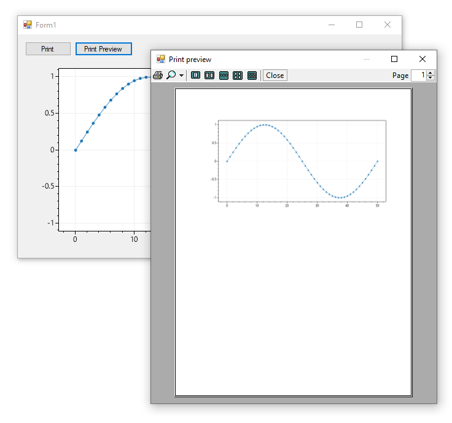

**The easiest way to print a plot is to render it as a `Bitmap` by calling `Plot.Render()`, then print the `Bitmap`.** Many resources are available online to indicate how to print an image using your framework of choice. This page demonstrates how I prefer to print plots using WinForms.

<div class="text-center">



</div>

## Windows Forms

* [**Download this example project**](https://github.com/ScottPlot/Website/tree/main/src/faq/print/src/)

```cs
public Form1()
{
    InitializeComponent();
    formsPlot1.Plot.AddSignal(ScottPlot.DataGen.Sin(51));
    formsPlot1.Plot.AddSignal(ScottPlot.DataGen.Cos(51));
}

private void PrintPage(object sender, PrintPageEventArgs e)
{
    // Determine how large you want the plot to be on the page and resize accordingly
    int width = e.MarginBounds.Width;
    int height = (int)(e.MarginBounds.Width * .5);
    formsPlot1.Plot.Resize(width, height);

    // Give the plot a white background so it looks good on white paper
    formsPlot1.Plot.Style(figureBackground: Color.White);

    // Render the plot as a Bitmap and draw it onto the page
    Bitmap bmp = formsPlot1.Plot.Render();
    e.Graphics.DrawImage(bmp, e.MarginBounds.Left, e.MarginBounds.Top);
}

private void btnPrint_Click(object sender, EventArgs e)
{
    var printDocument = new PrintDocument();
    printDocument.PrintPage += new PrintPageEventHandler(PrintPage);
    var printDialog = new PrintDialog { Document = printDocument };
    var printDiagResult = printDialog.ShowDialog();
    if (printDiagResult == DialogResult.OK)
        printDocument.Print();
}

private void btnPrintPreview_Click(object sender, EventArgs e)
{
    var printDocument = new PrintDocument();
    printDocument.PrintPage += new PrintPageEventHandler(PrintPage);
    var printDialog = new PrintPreviewDialog { Document = printDocument };
    printDialog.ShowDialog();
}
```