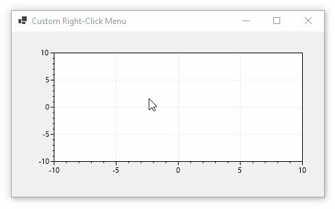

User controls have a `RightClicked` event handler you can add a custom event to. This event could open a context menu, but it could also perform other actions.

<div class='text-center'>



</div>

## Windows Forms

To customize ScottPlot's right-click menu, unsubscribe from the default right-click event add add your own event method to be called whenever the user right-clicks the plot. 

[Download this example from GitHub](https://github.com/ScottPlot/Website/tree/main/src/faq/right-click-menu/src/)

```cs
public Form1()
{
    InitializeComponent();
    
    // unsubscribe from the default right-click menu event
    formsPlot1.RightClicked -= formsPlot1.DefaultRightClickEvent;
    
    // add a custom right-click action
    formsPlot1.RightClicked += CustomRightClickEvent;
}

private void CustomRightClickEvent(object sender, EventArgs e)
{
    ContextMenuStrip customMenu = new ContextMenuStrip();
    customMenu.Items.Add(new ToolStripMenuItem("Add Sine Wave", null, new EventHandler(AddSine)));
    customMenu.Items.Add(new ToolStripMenuItem("Clear Plot", null, new EventHandler(ClearPlot)));
    customMenu.Show(Cursor.Position);
}

private void AddSine(object sender, EventArgs e)
{
    Random rand = new Random();
    double[] data = ScottPlot.DataGen.Sin(51, phase: rand.NextDouble() * 1000);
    formsPlot1.Plot.AddSignal(data);
    formsPlot1.Plot.AxisAuto();
    formsPlot1.Render();
}

private void ClearPlot(object sender, EventArgs e)
{
    formsPlot1.Plot.Clear();
    formsPlot1.Plot.AxisAuto();
    formsPlot1.Render();
}
```

## WPF

To customize ScottPlot's right-click menu, unsubscribe from the default right-click event add add your own event method to be called whenever the user right-clicks the plot. 

[Download this example from GitHub](https://github.com/ScottPlot/Website/tree/main/src/faq/right-click-menu/src/)

```cs
public MainWindow()
{
    InitializeComponent();

    // unsubscribe from the default right-click menu event
    WpfPlot1.RightClicked -= WpfPlot1.DefaultRightClickEvent;

    // add a custom right-click action
    WpfPlot1.RightClicked += DeployCustomMenu;
}

private void DeployCustomMenu(object sender, EventArgs e)
{
    MenuItem addSinMenuItem = new MenuItem() { Header = "Add Sine Wave" };
    addSinMenuItem.Click += AddSine;

    MenuItem clearPlotMenuItem = new MenuItem() { Header = "Clear Plot" };
    clearPlotMenuItem.Click += ClearPlot;

    ContextMenu rightClickMenu = new ContextMenu();
    rightClickMenu.Items.Add(addSinMenuItem);
    rightClickMenu.Items.Add(clearPlotMenuItem);

    rightClickMenu.IsOpen = true;
}

private void AddSine(object sender, RoutedEventArgs e)
{
    Random rand = new Random();
    double[] data = ScottPlot.DataGen.Sin(51, phase: rand.NextDouble() * 1000);
    WpfPlot1.Plot.AddSignal(data);
    WpfPlot1.Plot.AxisAuto();
}

private void ClearPlot(object sender, RoutedEventArgs e)
{
    WpfPlot1.Plot.Clear();
    WpfPlot1.Plot.AxisAuto();
}
```

## Disabling the default right-click menu

You can unsubscribe the event from the event handler in order to disable the default right-click menu in a pop-up plot viewer.  
```cs
cottPlot.Plot plt = new ();
plt.AddSignal(ScottPlot.DataGen.Sin(51));
plt.AddSignal(ScottPlot.DataGen.Cos(51));

ScottPlot.FormsPlotViewer viewer = new(plt);

// unsubscribe from the default right-click menu event
viewer.formsPlot1.RightClicked -= viewer.formsPlot1.DefaultRightClickEvent;

viewer.ShowDialog();
```