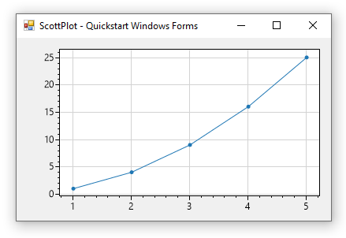

**Step 1:** Install the [`ScottPlot`](https://www.nuget.org/packages/ScottPlot) NuGet package. Linux & MacOS users must take [these additional steps](/faq/dependencies).

**Step 2:** Plot some data and save the figure as an image file


```cs
double[] dataX = new double[] { 1, 2, 3, 4, 5 };
double[] dataY = new double[] { 1, 4, 9, 16, 25 };
var plt = new ScottPlot.Plot(400, 300);
plt.AddScatter(dataX, dataY);
plt.SaveFig("quickstart.png");
```


## Launch an Interactive Window

Plots created in console applications can be launched in a pop-up window allowing interactive pan and zoom:

* Install [`ScottPlot.WinForms`](https://www.nuget.org/packages/ScottPlot.WinForms) (or one of the other ScottPlot control libraries)
* Create a `Plot` as described above
* Instantiate a `PlotViewer` with that `Plot` and `Show()` it

```cs
double[] dataX = new double[] { 1, 2, 3, 4, 5 };
double[] dataY = new double[] { 1, 4, 9, 16, 25 };
var plt = new ScottPlot.Plot(400, 300);
plt.AddScatter(dataX, dataY);
new ScottPlot.FormsPlotViewer(plt).ShowDialog();
```



> 💡 Interactive plots using the WinForms and WPF controls require the console application to target Windows, but a strategy for launching interactive plots from console applications running on Linux using Avalonia is described in [#1769](https://github.com/ScottPlot/ScottPlot/issues/1769#issuecomment-1093504868)