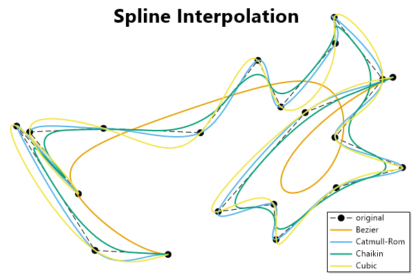
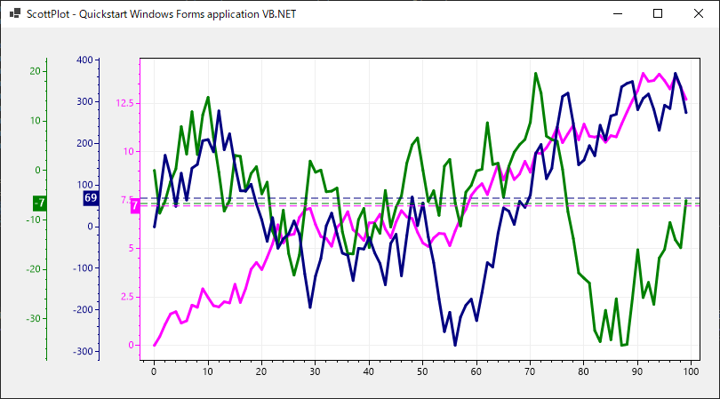

**Step 1:** Install the [`ScottPlot`](https://www.nuget.org/packages/ScottPlot) NuGet package

**Step 2:** Plot some data and save the figure as an image file

```vb
Module Program
    Sub Main(args As String())

        Dim plt = New ScottPlot.Plot(600, 400)
        plt.Palette = ScottPlot.Palette.ColorblindFriendly

        '' generate random data
        Dim rand = New Random(12345)
        Dim xs = ScottPlot.DataGen.RandomWalk(rand, 20)
        Dim ys = ScottPlot.DataGen.RandomWalk(rand, 20)
        plt.AddScatter(xs, ys, lineStyle:=ScottPlot.LineStyle.Dash, markerSize:=10, label:="original")

        '' interpolate the same data in different ways
        Dim bz = ScottPlot.Statistics.Interpolation.Bezier.InterpolateXY(xs, ys, 0.005)
        Dim cr = ScottPlot.Statistics.Interpolation.CatmullRom.InterpolateXY(xs, ys, 15)
        Dim ch = ScottPlot.Statistics.Interpolation.Chaikin.InterpolateXY(xs, ys, 4)
        Dim cb = ScottPlot.Statistics.Interpolation.Cubic.InterpolateXY(xs, ys, 200)

        '' display the different curves as line plots
        plt.AddScatterLines(bz.xs, bz.ys, lineWidth:=2, label:=$"Bezier")
        plt.AddScatterLines(cr.xs, cr.ys, lineWidth:=2, label:=$"Catmull-Rom")
        plt.AddScatterLines(ch.xs, ch.ys, lineWidth:=2, label:=$"Chaikin")
        plt.AddScatterLines(cb.xs, cb.ys, lineWidth:=2, label:=$"Cubic")

        '' style the plot
        plt.Legend()
        plt.Frameless()
        plt.Grid(False)
        plt.XAxis2.Label("Spline Interpolation", size:=28, bold:=True)
        plt.SaveFig("demo.png")
    End Sub
End Module
```



## Windows Forms Application

**Step 1:** Install the [`ScottPlot`](https://www.nuget.org/packages/ScottPlot) NuGet package

**Step 2:** Drag a `FormsPlot` control from the toolbox onto your Form

**Step 3:** Plot some data and call the control's `Refresh()` method

```vb
Imports ScottPlot

Public Class Form1

    Public Sub New()

        InitializeComponent()

        '' Prepare separate Y axes
        FormsPlot1.Plot.YAxis.Color(Color.Magenta)
        Dim yAxis1 = FormsPlot1.Plot.YAxis
        Dim yAxis2 = FormsPlot1.Plot.AddAxis(ScottPlot.Renderable.Edge.Left, 2, "", Color.Navy)
        Dim yAxis3 = FormsPlot1.Plot.AddAxis(ScottPlot.Renderable.Edge.Left, 3, "", Color.Green)

        '' Create data and add it to the plot
        Dim rand = New Random(0)
        Dim data1 As Double() = DataGen.RandomWalk(rand, 100, mult:=1)
        Dim data2 As Double() = DataGen.RandomWalk(rand, 100, mult:=10)
        Dim data3 As Double() = DataGen.RandomWalk(rand, 100, mult:=100)
        Dim avg1 As Double = data1.Sum() / data1.Length
        Dim avg2 As Double = data2.Sum() / data2.Length
        Dim avg3 As Double = data3.Sum() / data3.Length

        Dim plt1 = FormsPlot1.Plot.AddSignal(data1)
        plt1.YAxisIndex = 0
        plt1.LineWidth = 3
        plt1.Color = Color.Magenta

        Dim plt2 = FormsPlot1.Plot.AddSignal(data2)
        plt2.YAxisIndex = 3
        plt2.LineWidth = 3
        plt2.Color = Color.Green

        Dim plt3 = FormsPlot1.Plot.AddSignal(data3)
        plt3.YAxisIndex = 2
        plt3.LineWidth = 3
        plt3.Color = Color.Navy

        '' Add draggable horizontal lines specifying the vertical axis index for each
        Dim hline1 = FormsPlot1.Plot.AddHorizontalLine(avg1)
        hline1.DragEnabled = True
        hline1.Color = plt1.Color
        hline1.LineStyle = LineStyle.Dash
        hline1.YAxisIndex = 0
        hline1.PositionLabelBackground = plt1.Color
        hline1.PositionFormatter = Function(ByVal position As Double) position.ToString("N0")
        hline1.PositionLabel = True
        hline1.PositionLabelAxis = yAxis1

        Dim hline2 = FormsPlot1.Plot.AddHorizontalLine(avg3)
        hline2.DragEnabled = True
        hline2.Color = plt3.Color
        hline2.LineStyle = LineStyle.Dash
        hline2.YAxisIndex = 2
        hline2.PositionLabelBackground = plt3.Color
        hline2.PositionFormatter = Function(ByVal position As Double) position.ToString("N0")
        hline2.PositionLabel = True
        hline2.PositionLabelAxis = yAxis2

        Dim hline3 = FormsPlot1.Plot.AddHorizontalLine(avg2)
        hline3.DragEnabled = True
        hline3.Color = plt2.Color
        hline3.LineStyle = LineStyle.Dash
        hline3.YAxisIndex = 3
        hline3.PositionLabelBackground = plt2.Color
        hline3.PositionFormatter = Function(ByVal position As Double) position.ToString("N0")
        hline3.PositionLabel = True
        hline3.PositionLabelAxis = yAxis3

        '' update the plot
        FormsPlot1.Plot.AxisAuto()
        FormsPlot1.Refresh()
    End Sub
End Class
```


